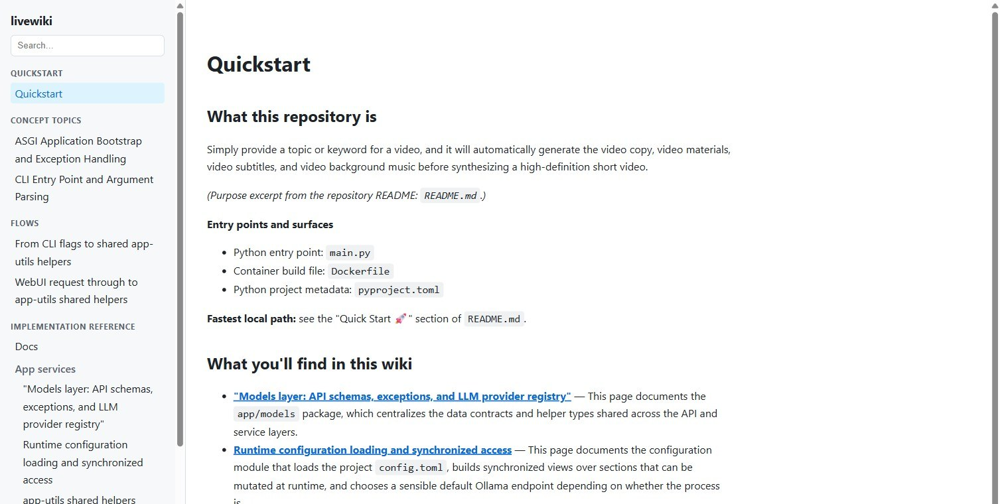

# livewiki

**Documentation that stays in sync with your code — written for you, verifiable against hallucination.**

livewiki turns a repository into a Markdown wiki that is *anchored* to real
code symbols. An LLM writes the prose; livewiki does the deterministic work:
it plans the pages, tracks what changed, preserves your edits, and validates
every reference so a stale or invented claim is caught mechanically.

[](https://www.npmjs.com/package/@livewiki/cli)
[](https://github.com/eduardoabreu81/livewiki/actions/workflows/cross-platform-ci.yml)
[](LICENSE)

`livewiki view` builds a self-contained offline site from the wiki — grouped
sidebar, offline search, diagrams, and dark mode:



*Example wiki generated by livewiki for MoneyPrinterTurbo-Plus, an external
Python repository.*

---

## Why

Technical docs go stale the moment the code changes. livewiki makes that
visible and cheap to fix instead of silent:

- **Anchored, not hand-waved.** Every code reference points at a real indexed
  symbol. `livewiki verify` reads the wiki fresh from disk and fails when a
  reference breaks — including references written by the LLM, without running
  `index` first.
- **Your edits win.** Pages you mark `owner: human` are never rewritten, and
  `lw:manual` blocks are preserved byte-for-byte.
- **Debt is tracked, not discovered.** `livewiki status` ranks what drifted;
  a GitHub Action can gate every merge on zero documentation debt, without
  spending tokens.
- **Works where you already work.** Bootstrap and maintain through the coding
  agent you use, or run a fully automated batch.

## Quick start

Requires **Node.js 24 or newer**.

### 1. Install

```bash
npm install -g @livewiki/cli
```

(`npx @livewiki/cli` works too, without installing globally.)

### 2. Initialize

From the root of the repository you want documented:

```bash
livewiki init
```

Indexes the code and creates the wiki skeleton under `livewiki/`, plus a
derived cache under `.livewiki/` (added to `.gitignore`). Deterministic — no
LLM call, no tokens.

### 3. Bootstrap the wiki once

You have two routes — pick one.

**Route A — through your coding agent (no API key needed):**

```bash
livewiki install
```

The installer detects your agent, wires the MCP server, the
document-as-you-go skill, and git hooks. Then ask the agent to bootstrap the
wiki; it pulls tasks from `livewiki_next_task` and submits pages with
`livewiki_write_doc` using the model it already has.

**Route B — a configured LLM API (unattended):**

```bash
livewiki config
```

The wizard lists the providers, asks for your API key (typed without echo),
and saves it. Bare `livewiki` on an unconfigured repo starts the same wizard.
Then:

```bash
livewiki init --batch
```

The resumable pipeline plans real page units and writes one page per source
file and folder, plus flows, concept topics, diagrams, and an
`understanding.md` synthesis. Interrupt it and resume with
`livewiki batch resume <runId>`.

### 4. Verify and browse

```bash
livewiki verify   # validate code references, internal links, and artifacts
livewiki view     # build an offline site with search, Mermaid, and dark mode
```

## Works with your coding agent

`livewiki install` auto-detects and wires **13 agents** over MCP (with skills
and hooks where the agent supports them):

Claude Code · Codex · Cursor · Kimi · Gemini CLI · OpenCode · OpenClaw ·
Cline · Kiro · Qwen · Warp · Zed · Hermes

Prefer manual wiring? Any stdio MCP client works:

```json
{
  "mcpServers": {
    "livewiki": {
      "command": "npx",
      "args": ["-y", "@livewiki/mcp", "--repo", "/path/to/repo"]
    }
  }
}
```

## Languages

| Language | Anchored docs (symbols extracted) |
| --- | --- |
| TypeScript | ✅ `.ts` |
| JavaScript | ✅ `.js` `.mjs` `.cjs` |
| TSX / JSX | ✅ `.tsx` `.jsx` |
| Python | ✅ `.py` |
| Go | ✅ `.go` |
| Rust | ✅ `.rs` |
| Java | ✅ `.java` |
| **Everything else** | Prose floor — every text file is walked and documented as prose, no symbols |

Anchored pages cite real symbols; the prose floor still gives every file a
place in the wiki. Tier-1 language support grows as the pattern is proven
(Go, Rust, and Java each landed this way).

## Providers

`livewiki config` lists these 17 presets. Each reads its own API-key
environment variable; `livewiki config show` prints the one your preset
expects without ever showing the value.

| Provider | Preset | Env var |
| --- | --- | --- |
| Anthropic | `anthropic` | `ANTHROPIC_API_KEY` |
| OpenAI | `openai` | `OPENAI_API_KEY` |
| OpenRouter | `openrouter` | `OPENROUTER_API_KEY` |
| DeepSeek | `deepseek` | `DEEPSEEK_API_KEY` |
| Kimi (Moonshot) | `kimi` | `MOONSHOT_API_KEY` |
| MiniMax | `minimax` | `MiniMax_API_KEY` |
| Google Gemini | `gemini` | `GEMINI_API_KEY` |
| NVIDIA | `nvidia` | `NVIDIA_API_KEY` |
| Ollama *(local)* | `ollama` | `OLLAMA_API_KEY` *(optional)* |
| LM Studio *(local)* | `lmstudio` | `LMSTUDIO_API_KEY` *(optional)* |
| Fireworks | `fireworks` | `FIREWORKS_API_KEY` |
| Novita | `novita` | `NOVITA_API_KEY` |
| GMI | `gmi` | `GMI_API_KEY` |
| StepFun | `stepfun` | `STEPFUN_API_KEY` |
| Hugging Face | `huggingface` | `HF_TOKEN` |
| xAI | `xai` | `XAI_API_KEY` |
| Alibaba (DashScope) | `alibaba` | `DASHSCOPE_API_KEY` |

`ollama` and `lmstudio` need no key for a local server. For CI and headless
automation, set the env var directly — it takes precedence over the saved key.

## What a generated page looks like

Excerpt from this repository's own
[`livewiki/core-src/verify.md`](livewiki/core-src/verify.md):

````markdown
## Discovery: walking the wiki from disk

The verifier never trusts the index for which pages exist — a doc freshly written by an LLM must be caught without first running `index`. Two walkers enumerate the `livewiki/` directory from disk; both skip hidden directories but keep dot-prefixed files.

<!-- lw:anchors packages/core/src/verify.ts#collectWikiPages packages/core/src/verify.ts#collectWikiArtifactPaths -->

```ts
async function collectWikiPages(absRoot: string): Promise<{ relPath: string }[]>
```
````

The prose explains the implementation; the `lw:anchors` marker ties the section
to real indexed symbols, so staleness and invalid references are detected
mechanically.

## How it works

- **Deterministic layer** — the CLI indexes source, extracts symbols, computes
  staleness, plans work, tracks debt, and verifies — without a model.
- **Writing layer** — a connected agent (or an API-backed batch) writes the
  prose, from a closed list of allowed symbol keys.
- **Validation layer** — code anchors, internal links, and artifacts are all
  checked against disk; invalid writes are rolled back.
- **Human ownership** — `owner: human` pages are never rewritten; `lw:manual`
  blocks are preserved byte-for-byte.
- **Portable baseline** — the accepted state of every documentation obligation
  lives in a versioned `livewiki/.baseline.json`, so debt is enforced against a
  real baseline and the wiki survives a deleted local cache.

Documentation debt can gate every merge in CI, without LLM calls or tokens —
see the [GitHub Actions template](packages/cli/templates/github-actions/docs-debt.yml).

Historical comparison methodology and dated results are archived in
[Benchmarks](docs/BENCHMARKS.md).

## Packages

| Package | Purpose |
| --- | --- |
| [`@livewiki/cli`](https://www.npmjs.com/package/@livewiki/cli) | The `livewiki` command |
| [`@livewiki/mcp`](https://www.npmjs.com/package/@livewiki/mcp) | MCP server for stdio-capable MCP clients |
| [`@livewiki/core`](https://www.npmjs.com/package/@livewiki/core) | Library: indexer, anchors, ledger, pipeline |

## Documentation

- [SPEC.md](SPEC.md) — behavior and format contracts
- [VISION.md](VISION.md) — product rationale and non-goals
- [docs/ROADMAP.md](docs/ROADMAP.md) — approved backlog and execution order

## License

MIT — see [LICENSE](LICENSE).
