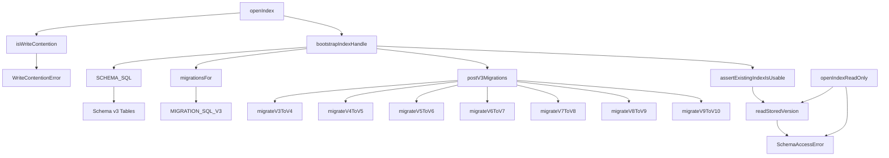

# SQLite Index Schema and Migration Pipeline

This module manages the livewiki SQLite index database at `<repoRoot>/.livewiki/index.db`, handling schema creation, versioned migrations, write-lock contention, and read-only access.

## When to use this page

- Understand how livewiki's derived index database is structured and versioned.
- Trace how schema migrations are discovered and applied from an older index version.
- Learn how write transactions handle SQLite's single-writer constraint and contention errors.
- See how read-only commands validate an existing index without ever modifying it.

## How it fits

The livewiki system derives a SQLite index from repository markdown, storing files, symbols, call graphs, rationales, documentation debt, batch runs, and manual blocks. Per SPEC rule #3, this database is purely cache — deleting `.livewiki/` only requires a `reindex`. This module provides the `db` layer that all indexers, CLI commands, editor hooks, and the MCP server's watcher rely on for opening, migrating, and querying the index. It sits between the safe-io validated path handling and higher-level indexer logic.



## Diagram

```mermaid
%% livewiki/diagrams/core-src-db.mmd
```

## Constants and schema baseline

<!-- lw:anchors packages/core/src/db.ts#CURRENT_SCHEMA_VERSION packages/core/src/db.ts#SCHEMA_VERSION_KEY packages/core/src/db.ts#SCHEMA_SQL packages/core/src/db.ts#MIGRATION_SQL_V3 -->

The module begins by defining constants that anchor all version handling. `CURRENT_SCHEMA_VERSION` is an `export const` holding the integer `10` — the highest schema revision this build understands. `SCHEMA_VERSION_KEY` is an `export const` string `"schema_version"` used as the `meta` table row key that records which revision an index currently holds.

The `SCHEMA_SQL` export is a large `CREATE TABLE IF NOT EXISTS` / `CREATE INDEX IF NOT EXISTS` block describing the full current shape: `files`, `symbols`, `meta`, `anchors`, `debt`, `undocumented`, `batch_runs`, `batch_tasks`, `doc_pages`, `manual_blocks`, `calls`, and `rationales`. These idempotent statements add missing tables without altering existing ones — crucial because a migrated database and a from-scratch database must converge to identical shape. Notably, the `idx_batch_tasks_claim` index is deliberately absent from `SCHEMA_SQL` because its column `lease_expires_at` does not exist on pre-v10 databases when this block executes.

`MIGRATION_SQL_V3` is an `export const` runnable SQL string performing the v2→v3 light migration: it adds `debt.symbol_key`, recreates the `symbols` table to replace an inline UNIQUE constraint with a partial unique index respecting soft-deleted rows, and builds the open-debt partial index.

## Write lock and contention handling

<!-- lw:anchors packages/core/src/db.ts#WRITE_LOCK_TIMEOUT_MS packages/core/src/db.ts#WriteContentionError packages/core/src/db.ts#WriteContentionError.constructor packages/core/src/db.ts#isWriteContention packages/core/src/db.ts#runWriteTransaction -->

SQLite permits exactly one writer at a time, and livewiki invokes indexing concurrently (CLI, editor hook, MCP watcher). To avoid a second writer discovering conflict halfway through its mutation, the indexer begins a write phase with `BEGIN IMMEDIATE`; a second writer queues rather than failing early. `WRITE_LOCK_TIMEOUT_MS` is an `export const` set to 30,000 (milliseconds), covering a full write transaction of the writer ahead in line — measured worst case is about 5.5 seconds for 300 new files, so 30s leaves headroom for a cold first index while still failing in a human timeframe for a wedged writer. It governs reads in the same connection too, protecting readers from checkpointing writers.

`WriteContentionError` is an `export class` extending `Error` with a `readonly code = "INDEX_WRITE_CONTENTION"`. Its constructor `constructor(readonly phase: string, cause: unknown)` builds a message telling the user another process holds the write lock and which phase (`phase`) was blocked. This class takes the phase name and the original cause, producing a human-actionable instruction rather than raw "database is locked".

`isWriteContention` is an `export function` that takes an `unknown` error value and returns a boolean; it extracts a `code` property and checks for `"SQLITE_BUSY"`, `"SQLITE_BUSY_SNAPSHOT"`, or `"SQLITE_BUSY_TIMEOUT"`. `SQLITE_BUSY_SNAPSHOT` is listed for completeness but not expected — it means a DEFERRED transaction read first and then tried to write, bypassing the busy handler; callers using `BEGIN IMMEDIATE` prevent this by design.

`runWriteTransaction` is an `export function` with signature `runWriteTransaction<T>(phase: string, tx: { immediate: () => T }): T`; it takes a phase name and a transaction object holding an `immediate` function, then invokes `tx.immediate()`. If that throws, the function checks `isWriteContention(err)`; on contention it throws a new `WriteContentionError`; every other error passes through untouched because it genuinely is an index error.

## Schema access validation errors

<!-- lw:anchors packages/core/src/db.ts#SchemaAccessError packages/core/src/db.ts#SchemaAccessError.constructor packages/core/src/db.ts#SchemaAccessError.describe packages/core/src/db.ts#readStoredVersion -->

When the existing index cannot be used as-is, the appropriate fix is a human action (rerun indexing, upgrade LiveWiki, delete cache) rather than a retry. `SchemaAccessError` is an `export class` extending `Error` that encodes one of four problems: `"missing_database"` (no `.livewiki/index.db`), `"missing_version"` (file exists but no `schema_version` row), `"older_index"` (older than this build — needs migration), `"newer_index"` (newer than this build — requires upgrading LiveWiki).

Its constructor is `constructor(kind: SchemaAccessProblem, stored: number | null, dbPath: string)`; it takes the problem kind, the stored version integer (or `null`), and the database path, and constructs a human-readable message via the static helper, then records `kind`, `stored`, and `current = CURRENT_SCHEMA_VERSION` as public fields. The message for older/newer indexes includes both the stored and current version numbers, giving the user concrete guidance.

The private static method `describe(kind: SchemaAccessProblem, stored: number | null, dbPath: string): string` takes the same three arguments and returns one of four tailored instructions. It switches over `kind`: `"missing_database"` instructs running `livewiki index` (read-only commands never create the index); `"missing_version"` explains the provenance cannot be determined and recommends deleting plus rebuilding; `"older_index"` tells the user to run `livewiki index` to migrate; `"newer_index"` advises upgrading LiveWiki.

`readStoredVersion` is a `function` taking a `better-sqlite3` database handle and returning `number | null`; it runs a `SELECT value FROM meta WHERE key = ?` with `SCHEMA_VERSION_KEY`. If no row exists it returns `null`; if the stored string fails `Number.parseInt` it also returns `null` — meaning an unparseable value is treated as absence for migration-eligibility purposes.

## Existing index usability gate

<!-- lw:anchors packages/core/src/db.ts#assertExistingIndexIsUsable -->

`assertExistingIndexIsUsable` is a `function` that takes an already-open database handle plus its path and returns `void`; it decides whether an existing index file may be initialized and migrated further. This check runs read-only — every probe is a `SELECT`, so a rejection leaves the file byte-for-byte untouched.

It first counts user objects in `sqlite_master`, excluding `sqlite_*` internal entries, and returns early if that count is zero (effectively empty — indistinguishable from a fresh file). With domain objects present, it verifies a `meta` table exists; absence means unknown provenance, so it closes the handle and throws `SchemaAccessError("missing_version", null, dbPath)`. Next it calls `readStoredVersion`; a `null` result likewise throws `missing_version`. Finally, if the stored version exceeds `CURRENT_SCHEMA_VERSION`, it closes and throws `newer_index` — an older version is allowed to pass since migrations will follow.

## Index bootstrap flow

<!-- lw:anchors packages/core/src/db.ts#bootstrapIndexHandle packages/core/src/db.ts#openIndex -->

`openIndex` is the writer's `export function` with signature `openIndex(dbPath: string): Database.Database`; it takes a filesystem path and returns an open, migrated `better-sqlite3` handle. The caller (indexer) has already validated the path through safe-io and created the `.livewiki/` directory. This function captures `existedBefore` via `nodeFsSync.existsSync(dbPath)` before constructing `new Database(dbPath)`, because once opened the file exists either way. It sets `busy_timeout = WRITE_LOCK_TIMEOUT_MS` as the FIRST statement — before the compatibility gate, journal mode, or any DDL — because position matters: previously placed after `journal_mode`, the driver's default 5s timeout applied to earlier statements, which is a fifth of the promised wait.

Everything after busy_timeout can contend with another process, yet none of it runs inside `runWriteTransaction`. `openIndex` therefore wraps `bootstrapIndexHandle` in a try/catch; if `isWriteContention` detects contention it closes the handle (preventing a Windows `-wal` file lock) and throws `WriteContentionError("open", err)`. Any other error propagates unchanged.

`bootstrapIndexHandle` is a `function` taking the open handle, path, and `existedBefore` flag; it returns `void` and performs the mutable half of initialization. It runs the compatibility gate FIRST by calling `assertExistingIndexIsUsable` when the file existed — rejecting mutates nothing, before journal mode or DDL. Then it sets `journal_mode = WAL`, `foreign_keys = ON`, `synchronous = NORMAL`. Because `SCHEMA_SQL` carries a v9 index expression referencing columns a pre-v8 database lacks, `bootstrapIndexHandle` checks whether `debt` lacks `symbol_key` or `doc_page_id`; if so it creates a temporary legacy `idx_debt_open` on `(anchor_id, event)` so `CREATE INDEX IF NOT EXISTS` stays safe until migrations replace it. After `db.exec(SCHEMA_SQL)`, it reads `schema_version` from `meta`. With no row, it inserts `CURRENT_SCHEMA_VERSION` directly. With a stored lower version, it iterates `migrationsFor` (discriminating a string via `db.exec` versus a function by direct call) then `postV3Migrations`, and finally updates `schema_version`. It ends by creating `idx_batch_tasks_claim` — the one index excluded from `SCHEMA_SQL` because `lease_expires_at` exists only after migration or from-scratch creation.

## Version-to-migration selection

<!-- lw:anchors packages/core/src/db.ts#migrationsFor packages/core/src/db.ts#postV3Migrations -->

The migration pipeline is split into two selection functions so tests remain deterministic and SQL strings versus JavaScript functions execute differently. `migrationsFor` is an `export function` whose signature `migrationsFor(fromVersion: number, toVersion: number)` takes two version integers and returns an array where each element is either a SQL string or `(db) => void` function. Currently it only pushes `MIGRATION_SQL_V3` when `fromVersion < 3 && toVersion >= 3`, serving the pre-v3 path.

`postV3Migrations` is an `export function` with signature `postV3Migrations(fromVersion: number, toVersion: number)` taking two version integers and returning an array of `(db) => void` functions. It conditionally pushes each migration step for destination versions above the start: `migrateV3ToV4` for crossing 4, `migrateV4ToV5` for 5, and so on through `migrateV9ToV10`. Each entry runs only when the source is below the destination threshold, matching the guard logic in `bootstrapIndexHandle`.

## Migration v3 to v4

<!-- lw:anchors packages/core/src/db.ts#migrateV3ToV4 -->

`migrateV3ToV4` is an `export function` taking a `better-sqlite3` handle and returning void; it extends `batch_runs` with Phase-3 run-audit columns and creates backing indexes. This is a JavaScript function rather than a pure SQL string because `SCHEMA_SQL` already carries the current shape; on a from-scratch database the columns exist, so idempotence demands checking `PRAGMA table_info(batch_runs)` before each `ALTER TABLE ADD COLUMN` since SQLite lacks `ADD COLUMN IF NOT EXISTS`.

The function collects existing column names into a `Set`, then conditionally adds `finished_at INTEGER`, `started_by TEXT NOT NULL DEFAULT 'cli'`, and `summary_json TEXT`. It then executes `CREATE INDEX IF NOT EXISTS` statements for `idx_batch_runs_status`, `idx_batch_tasks_run_id`, and `idx_batch_tasks_status` — making `batch status <run>` O(1).

## Migrations v4 to v6 — new tables

<!-- lw:anchors packages/core/src/db.ts#migrateV4ToV5 packages/core/src/db.ts#migrateV5ToV6 -->

Both `migrateV4ToV5` and `migrateV5ToV6` are `export function`s taking a database handle and returning void, each introducing one new table plus its indexes. Each reuses the identical `CREATE TABLE IF NOT EXISTS` and `CREATE INDEX IF NOT EXISTS` statements found in `SCHEMA_SQL` rather than duplicating definitions, guaranteeing a from-scratch database and a migrated one converge to the same shape.

`migrateV4ToV5` creates the `calls` table for symbol call graphs: raw, deterministic call sites extracted per file, with `resolved_callee_key` left `NULL` for callees the resolver could not confidently match. Backing indexes cover `file_id`, `caller_key`, and `resolved_callee_key`. `migrateV5ToV6` creates `rationales` for intent evidence from tagged comments and docstrings, with `symbol_key` nullable for file-level entries; indexes cover `file_id` and `symbol_key`.

## Migrations v6 to v7 — column addition

<!-- lw:anchors packages/core/src/db.ts#migrateV6ToV7 -->

`migrateV6ToV7` is an `export function` taking a database handle and returning void; it adds `calls.confidence` tagging each call-graph edge as `'extracted'` or `'inferred'`. As with other column additions it is a JS function checking `PRAGMA table_info(calls)` because `SCHEMA_SQL` already carries the column for fresh databases. If `confidence` is absent it executes `ALTER TABLE calls ADD COLUMN confidence TEXT NOT NULL DEFAULT 'inferred'` — `'inferred'` is the conservative default because a pre-v7 edge has no recorded extraction shape.

## Migrations v7 to v10 — debt and batch task columns

<!-- lw:anchors packages/core/src/db.ts#migrateV7ToV8 packages/core/src/db.ts#migrateV8ToV9 packages/core/src/db.ts#migrateV9ToV10 -->

`migrateV7ToV8` is an `export function` taking a database handle and returning void; it makes `debt` rows durable even when the original `anchors` row disappears. Checking `PRAGMA table_info(debt)`, it conditionally adds `doc_page_id INTEGER`, then backfills from still-existing anchor rows using an `UPDATE ... SELECT` so `debt.doc_page_id` holds the page reference even after the anchor is edited out.

`migrateV8ToV9` is an `export function` taking a database handle and returning void; it deduplicates open debt rows that legitimate page-plus-section anchors created, and invalidates open `'deleted'` rows whose symbol is active again. The entire operation runs inside `db.transaction`: it drops `idx_debt_open`, deletes duplicate open rows keeping only the smallest `id` per `(symbol_key, COALESCE(doc_page_id, -1), event)` group, deletes open `'deleted'` rows where an active `symbols` row with the same key exists, and recreates `idx_debt_open`. Resolved rows are historical payment records and remain untouched.

`migrateV9ToV10` is an `export function` taking a database handle and returning void; it adds `batch_tasks.claim_id` and `batch_tasks.lease_expires_at` for the agent bootstrap queue's one-task-per-executor claims. It is idempotent via `PRAGMA table_info` because `SCHEMA_SQL` already carries both columns on fresh databases. Existing pre-v10 rows deliberately retain `NULL` in both columns — any row left `'running'` becomes immediately re-claimable, replicating pre-existing crash-recovery semantics. It finally creates `idx_batch_tasks_claim` on `(run_id, status, lease_expires_at)`.

## Read-only index opener

<!-- lw:anchors packages/core/src/db.ts#openIndexReadOnly -->

`openIndexReadOnly` is an `export function` with signature `openIndexReadOnly(dbPath: string): Database.Database`; it takes a filesystem path and returns a read-only `better-sqlite3` handle for an existing index. Unlike `openIndex`, it creates nothing, runs no DDL, applies no migration, and never writes `schema_version`. This matters because a pending migration would turn every plain read into a write queueing behind the write lock (measurably `SQLITE_BUSY` after the full timeout), and an older build could otherwise migrate or relabel a newer database.

It first checks file existence via `nodeFsSync.existsSync`, throwing `SchemaAccessError("missing_database", null, dbPath)` if absent. After constructing `new Database(dbPath, { readonly: true })`, it sets only `busy_timeout = 5000` session-scoped (no `journal_mode` which rewrites the header). The remainder sits in a try/catch: it reads the stored version, then throws `missing_version`, `older_index`, or `newer_index` appropriately — but crucially it returns the handle on a version match. On any thrown error it closes the handle before rethrowing, preventing resource leaks.

## Tests

Covered by `packages/core/src/db.test.ts` (same-name test file on disk).
Likely also exercised by `packages/core/src/db-schema-access.test.ts` (name-prefix match, not verified).
